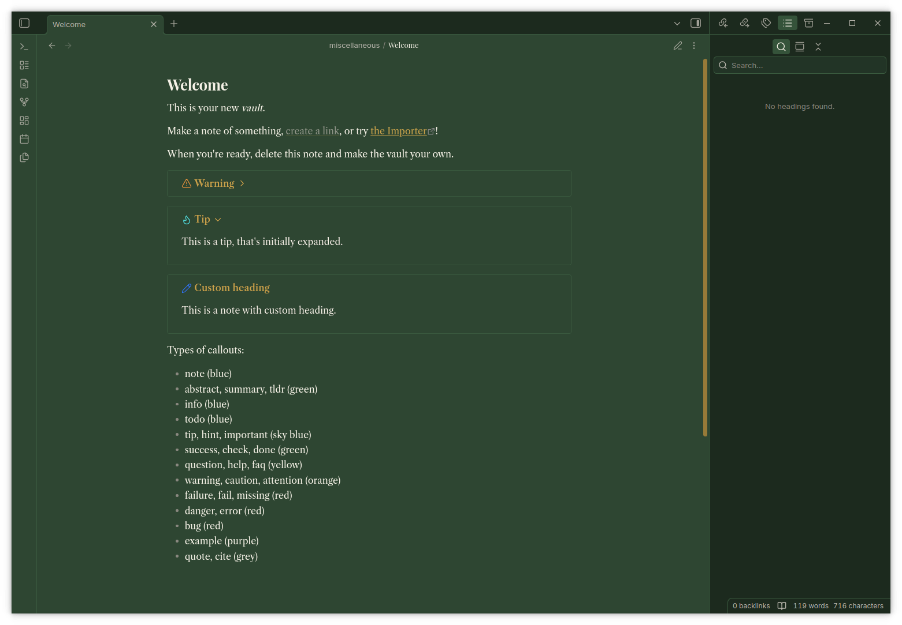

# UK Countryside Dark

A dark Obsidian theme built around a British countryside palette: hedgerow green, mustard wheat, and limestone. Companion to a matching KDE Plasma, Konsole, and Thunderbird theme set.

## Palette

| Role | Colour | Hex |
|---|---|---|
| Background | Hedgerow green | `#2e4632` |
| Accent | Mustard wheat | `#c9a24b` |
| Text | Limestone | `#f5f1e6` |

## Fonts

Headings use Playfair Display, body text uses Libre Caslon Text, and the interface (sidebar, menus) uses Inter. Code blocks use JetBrains Mono. All four must be installed on your system, Obsidian doesn't bundle fonts, it just references whatever fontconfig can find. If a font isn't installed, that element falls back to Georgia or your system default rather than breaking.

## Installation

1. Download `manifest.json` and `theme.css` from the [latest release](../../releases/latest).
2. Create a folder named `UK Countryside Dark` inside your vault's `.obsidian/themes/` directory.
3. Place both files in that folder.
4. In Obsidian, go to Settings > Appearance > Themes, and select "UK Countryside Dark". Make sure the base colour scheme is set to Dark.

## Customisation

The theme uses standard Obsidian CSS variables (`--background-primary`, `--text-accent`, etc.) plus a few direct selector overrides for headings, callouts, tags, and code blocks. Open `theme.css` and adjust the hex values at the top of the `.theme-dark` block to retint anything.

## License

MIT. See [LICENSE](LICENSE).
